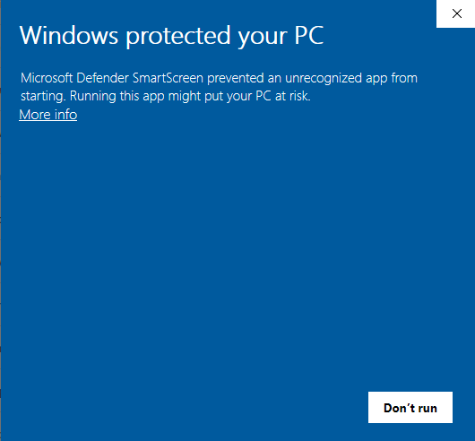

# Actions Per Minute Tracker

An Actions Per Minute (APM) tracker to povide real-time stats on your actions per minute.

This program runs in the background and creates a small "APM" window that sits on top of your game screen.

This project currently only supports Windows.

## Installation

### Windows

Check out the [releases here](1). You probably want the win64 version.
1. Download the .exe file (e.g. `ActionsPerMinuteTracker-win64.exe`)
2. Run it to start tracking
3. See your actions per minute in the upper right corner

### Linux

Not currently supported

### From source

1. Clone the repo
2. Open in Visual Studio Code
3. Build

## Examples

### Age of Empires 4

### Dota 2

[releases]: https://github.com/KlotzAndrew/actions-per-minute-tracker/releases

## Issues

### Windows warnings

The release exe files are not signed with a [Microsoft code signing certificate][code_signing]. This
means there are some ugly warning messages when trying to download & run the program. If you click though
them the program will run as expected

The code singing certificates are expensive, so the only current workaround is to clone and compile the program yourself (reach out if you have other ideas!)

[code_signing]: https://docs.microsoft.com/en-us/windows-hardware/drivers/dashboard/get-a-code-signing-certificate
